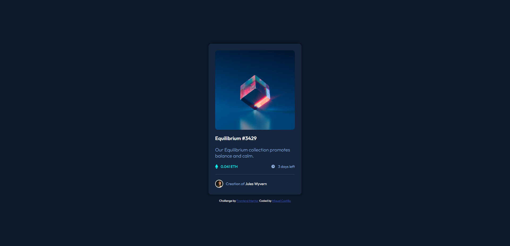

# Frontend Mentor - NFT Preview Card Component Solution

This is a solution to the [NFT preview card component challenge on Frontend Mentor](https://www.frontendmentor.io/challenges/nft-preview-card-component-SbdUL_w0U). Frontend Mentor challenges help you improve your coding skills by building realistic projects. 

## Table of contents

- [Overview](#overview)
  - [The challenge](#the-challenge)
  - [Screenshot](#screenshot)
  - [Links](#links)
- [My process](#my-process)
  - [Built with](#built-with)
  - [What I learned](#what-i-learned)
  - [Continued development](#continued-development)
  - [Useful resources](#useful-resources)
- [Author](#author)
- [Acknowledgments](#acknowledgments)

## Overview

An NFT preview card component challenge made with HTML5 and CSS3.

### The challenge

Users should be able to:

- View the optimal layout depending on their device's screen size
- See hover states for interactive elements

### Screenshot

### Links

- Solution URL: [Code](https://github.com/Mig-uel/nft-preview-card-component)
- Live Site URL: [Live](https://mig-uel.github.io/nft-preview-card-component/)

## My process

Container for everything!!! Flex is love.

### Built with

- Semantic HTML5 markup
- CSS custom properties
- Flexbox
- Mobile-first workflow

### What I learned

I learned how to load image on hover without javascript.

### Continued development

Continued development includes updating the project to React.

### Useful resources

- [The Net Ninja](https://www.youtube.com/channel/UCW5YeuERMmlnqo4oq8vwUpg) - The Net Ninja is an awesome all-around channel for web developement and more.
- [Kevin Powell](https://www.youtube.com/kepowob) - Amazing CSS content!

## Author

- Website - [Miguel Castillo](https://www.miguelcastillo.net)
- Frontend Mentor - [@mig-uel](https://www.frontendmentor.io/profile/mig-uel)

## Acknowledgments

- [Saikat Safa](https://github.com/saikatsafa) - Amazing QA
